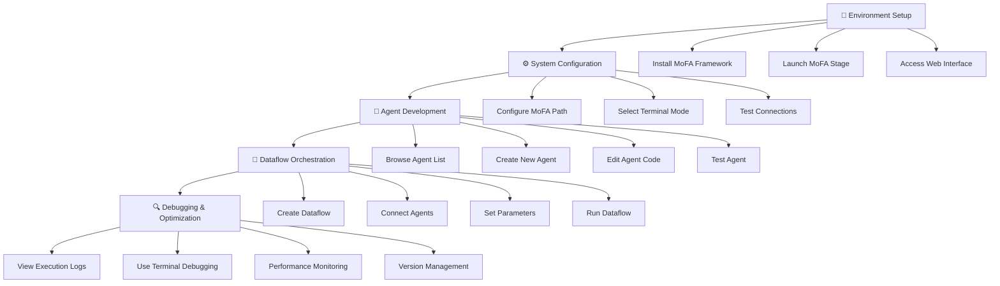

# MoFA_Stage

English | [中文](README_cn.md)

MoFA_Stage is a web-based development tool for managing and editing Agents and Dataflows in the MoFA framework.

## Features

- **Agent Management**
  - Browse Agent list
  - Create and copy Agents
  - Edit Agent files
  - Run and stop Agents
  - View execution logs

- **Terminal Access**
  - Web terminal
  - SSH connections
  - ttyd integration

- **Code Editing**
  - Text editor
  - File browser
  - VSCode Server integration (optional)

## Technology Stack

**Backend**
- Python + Flask
- WebSocket support
- SSH terminal integration
- RESTful API

**Frontend**
- Vue 3 + Element Plus
- Monaco editor

**Third-party Services**
- ttyd (recommanded)
- code-server (optional)

## Quick Start

### 🐳 Docker Deployment (Recommended)

For the fastest setup with no environment conflicts, use Docker:

```bash
# One-line deployment
docker run -d -p 3000:80 liyao1119/mofa-stage-frontend

# Then start backend
cd backend && python app.py
```

See [Docker Quick Start Guide](DOCKER_QUICKSTART.md) for detailed instructions.

### Traditional Installation

#### Environment Requirements

**System Support**
- Linux (supports apt-get and yum package managers)
- macOS
- Windows is not currently supported, WSL (Windows Subsystem for Linux) is recommended

**Software Requirements**
- Python 3.8 or higher
- Node.js 14 or higher
- MoFA framework installed

#### Installation and Run Scripts

The project provides two scripts:

- **install**: One-click installation of all dependencies
  ```bash
  chmod +x install
  ./install
  ```
  Automatically installs backend/frontend dependencies, with options for Docker or traditional installation.

- **run**: One-click service startup
  ```bash
  chmod +x run
  ./run
  ```
  Supports both Docker and traditional deployment modes.

### Development Mode

1. Start the backend
```bash
cd backend
python app.py
```

2. Start the frontend (development mode)
```bash
cd frontend
npm run dev
```

Access http://localhost:3000.

### Production Deployment

1. Build the frontend
```bash
cd frontend
npm run build  # Generates in the dist directory
```

2. Deployment methods (choose one)

**Using Nginx**

```nginx
server {
    listen 80;
    
    # Static files
    location / {
        root /path/to/mofa_stage/frontend/dist;
        try_files $uri $uri/ /index.html;
    }
    
    # API forwarding
    location /api {
        proxy_pass http://localhost:5002;
        proxy_set_header Host $host;
        proxy_set_header X-Real-IP $remote_addr;
    }
    
    # WebSocket
    location /api/webssh {
        proxy_pass http://localhost:5001;
        proxy_http_version 1.1;
        proxy_set_header Upgrade $http_upgrade;
        proxy_set_header Connection "upgrade";
    }
}
```

**Simple Deployment**

Using Python's built-in HTTP server:
```bash
cd frontend/dist
python -m http.server 3000
```

Start the backend:
```bash
cd backend
python app.py
```

## Common Issues

### Port Occupation

If you encounter port occupation issues, you can use this command to release ports:

```bash
for port in 3000 5001 5002 7681; do
    pid=$(lsof -t -i:$port)
    if [ -n "$pid" ]; then
        kill -9 $pid
        echo "Released port $port"
    fi
done
```

### Port Description

- 3000: Frontend service
- 5001: WebSSH service
- 5002: Main backend API
- 7681: ttyd terminal

### ttyd Installation Failure

If ttyd automatic installation fails, you can refer to the [ttyd GitHub page](https://github.com/tsl0922/ttyd) for manual installation.

## Directory Structure

```
mofa-stage/
├── backend/
│   ├── app.py              # Main application
│   ├── config.py           # Configuration
│   ├── routes/             # API routes
│   │   ├── agents.py       # Agent management
│   │   ├── terminal.py     # Terminal features
│   │   ├── webssh.py       # SSH connections
│   │   ├── vscode.py       # VSCode integration
│   │   ├── settings.py     # Settings management
│   │   ├── ttyd.py         # ttyd integration
│   │   └── mermaid.py      # Chart rendering
│   ├── utils/              # Utility modules
│   │   ├── mofa_cli.py     # MoFA command wrapper
│   │   ├── file_ops.py     # File operations
│   │   └── ttyd_manager.py # ttyd management
│   └── requirements.txt    # Python dependencies
├── frontend/
│   ├── src/
│   │   ├── views/          # Page components
│   │   ├── components/     # UI components
│   │   ├── api/            # API calls
│   │   ├── store/          # State management
│   │   └── router/         # Routing
│   └── package.json        # Node.js dependencies
├── install.sh              # Installation script
└── run.sh                  # Startup script
```

## User Journey



